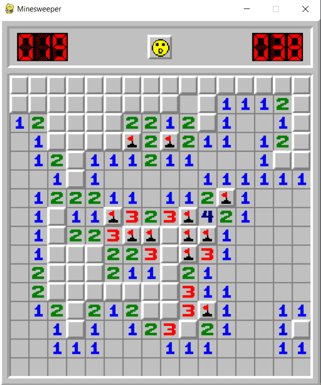
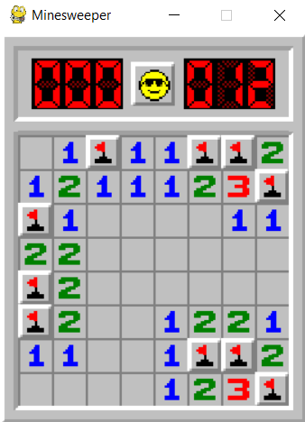
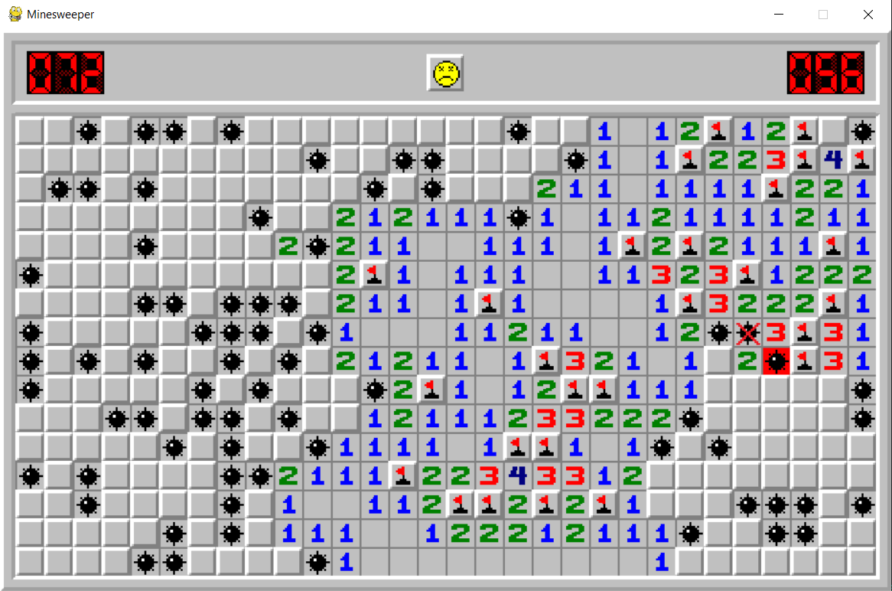

# Minesweeper

Minesweeper game written in python, using pygame. 

Game features:

- LMB to open a tile, RMB to flag a tile.
- Hold down an open tile to see all of its neighbours.
- LMB a number that has flagged neighbour tiles equal to the number value to open all of its remaining neighbours.

To change game setting, modify the values in the settings file:
```
TILESIZE = x
ROWS = x
COLS = x
AMOUNT_MINES = x
```

Gameplay screenshots:

- Holding a tile:


- Win:


- Lose:
